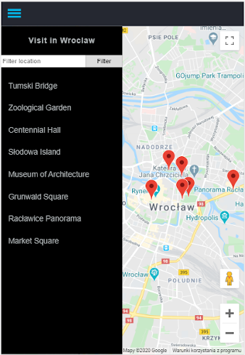
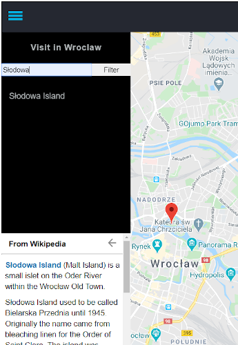

# Neighborhood Map (React)
The final project of the Front-End Web Developer Nanodegree with Udacity course. The main goal of this project is to continue learning with React framework and external APIs.
## How to use
This application shows popular places to visit in Wroclaw. All locations are listed by clicking on the menu icon. You can choose directly from the list view, or filter by typing the name of the chosen location. Clicking on a place either from the menu list or map markers shows short information from Wikipedia.
| The list of locations   | Selected location |
|  :---:          |     :---:     |
| | |
## How to deploy
* To get started clone [repository](https://github.com/pressR2/NeighborhoodMap.git).
* Replace `<your GOOGLE MAPS API KEY HERE>` inside of `GoogleMaps.js` with your key.
* Install all project dependencies with `npm install`.
* Start the development server with `npm start`.
### Requirements
[Node.js](https://nodejs.org)
### Dependencies
* This project was bootstrapped with [Create React App](https://github.com/facebook/create-react-app).
* [react-responsive](https://github.com/contra/react-responsive)
* [html-to-react](https://www.npmjs.com/package/html-to-react)
### This application also uses
* [Google Maps API key](https://developers.google.com/maps/documentation/javascript/get-api-key)
* [Google Maps API](https://cloud.google.com/maps-platform/)
* [MediaWikiAPI for Wikipedia](https://www.mediawiki.org/wiki/API:Main_page)
### Link to site
https://pressr2.github.io/NeighborhoodMap/

\#Hamburger and arrow-back icon from Udacity materials.